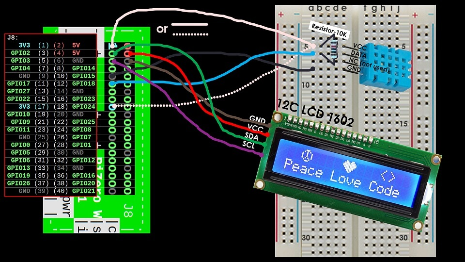

# PT_Library_Pi_UltimateRaspetarberry
PT_Library_Pi_UltimateRaspetarberry is a public repository which contains a personal collection of libraries, demos and diagrams for Raspberry Pi.

## General Information

## Contents
- /demos - Python scripts that implement the libraries of this repository
- /diagrams - Images that represent personally drawn diagrams of the connections between Pi and gadgets onto a breadboard
- /libraries - Python scripts that wrap outer libraries for easier use of different sensors and other gadgets through the Pi's GPIO

## Technologies
- import multiprocessing (with lock)
	- demos/raspetarberryPiDemoLCD1602AndTempSensorDHT11_01.py

## Sources of Information
