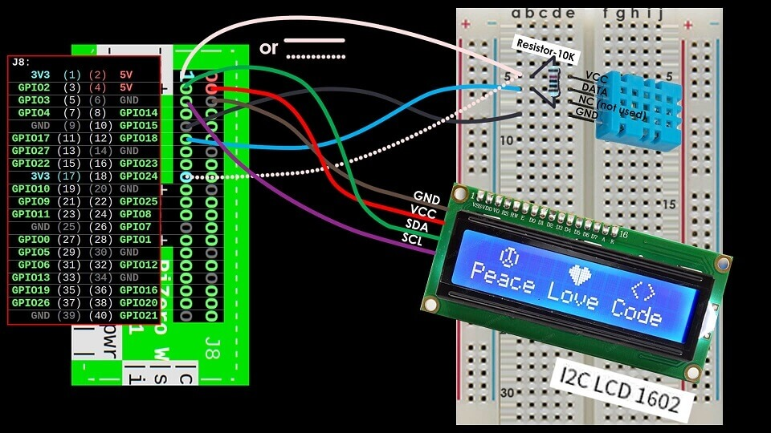

# PT_Library_Pi_UltimateRaspetarberry

## General Information
PT_Library_Pi_UltimateRaspetarberry is a public repo which contains a personal collection of libraries, demos and diagrams for Raspberry Pi.

## Contents
- /demos - Python scripts that implement the libraries of this repository
- /diagrams - Images that represent personally drawn diagrams of the connections between Pi and gadgets onto a breadboard
- /libraries - Python scripts that wrap outer libraries for easier use of different sensors and other gadgets through the Pi's GPIO

## Technologies
- import multiprocessing (with lock)
	- demos/raspetarberryPiDemoLCD1602AndTempSensorDHT11_01.py

## Sources of Information
[Good article on Multiprocessing](https://analyticsindiamag.com/run-python-code-in-parallel-using-multiprocessing/#:~:text=Multiprocessing%20in%20Python%20enables%20the,run%20tasks%2Fprocesses%20in%20parallel.&text=Multiprocessing%20enables%20the%20computer%20to,involve%20a%20lot%20of%20computation.)  
[Stack Overflow article on Multiprocessing with Lock](https://stackoverflow.com/questions/28267972/python-multiprocessing-locks)
[Article on 7-Segment-Display implementation](https://www.stuffaboutcode.com/2016/10/raspberry-pi-7-segment-display-gpiozero.html)
[Article on Keypad implementation](https://www.digikey.bg/en/maker/blogs/2021/how-to-connect-a-keypad-to-a-raspberry-pi)
[Article on Stepping Motor](https://www.aranacorp.com/en/control-a-stepper-with-raspberrypi/)
