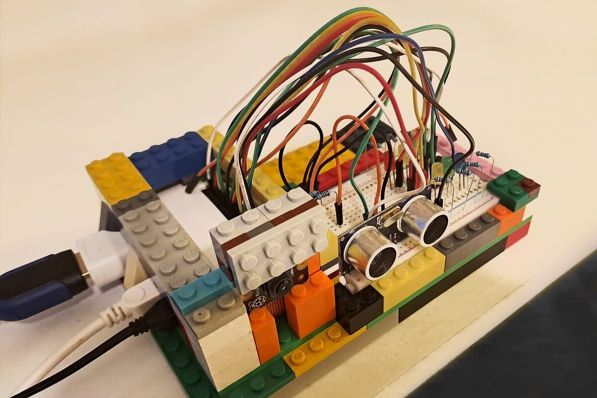

# PT_Library_Pi_UltimateRaspetarberry

PT_Library_Pi_UltimateRaspetarberry is a public repo which contains a personal collection of libraries, demos, projects and diagrams for Raspberry Pi using Python.


# Contents
- [Setup](#setup)
	- [Setup Pico / Setup Pico W / Pico 2 W](#setup-pico--pico-w--pico-2-w)
	- [Setup Zero W / Zero 2 W](#setup-zero-w--zero-2-w)
		- [Initial Setup](#initial-setup-zero-w)
		- [💡 Send Files using SCP Client](#send-files-using-scp-client)
	- [Setup Pi 4](#setup-pi-4)
- [Projects](#projects)
	- [Project Pico Game Boy](#project-pico-game-boy)
	- [Project Pico W Weather Station](#project-pico-w-weather-station)
		- [Flow](#flow)
			- [Weather Station](#weather-station)
			- [Reporting](#reporting)
		- [💡 Encrypt Secrets with Base64](#encrypt-secrets-with-base-64)
		- [💡 Send Data to Google Sheets](#send-data-to-google-sheets)
	- [Project Pico GPS Logger](#project-pico-gps-logger)
		- [Prerequisites GPS](#prerequisites-gps)
		- [Setup GPS](#setup-gps)
	- [Project Pi Zero W Parktronic Security](#project-pi-zero-w-parktronic-security)
		- [Prerequisites](#prerequisites)
		- [💡 Set Raspberry Pi Camera Module v2.1 NoIR](#set-raspberry-pi-camera-module-v21-noir)
			- [Known Issues](#known-issues-camera)
		- [💡 Use Google Drive API to send Images](#use-google-drive-api-to-send-images)
			- [Known Issues](#known-issues-pydrive2)
		- [Set Crontab for Parktronic](#set-crontab-for-parktronic)
	- [Project Pi Zero 2 W Parking Space Invaders](#project-pi-zero-2-w-parking-space-invaders)
		- [Ultralytics YOLO](#ultralytics-yolo)
		- [Torchvision](#torchvision)
- [Projects Old](#projects-old)
- [Demos](#demos)
	- [Radio Demo](#radio-demo)
- [Demos Old](#demos-old)
- [Sensors](#sensors)
	- [LCD1602 RGB Module](#lcd1602-rgb-module)
	- [DHT22 Temperature and Humidity Sensor](#dht22-temperature-and-humidity-sensor)
	- [Dust Sensor Sharp GP2Y1010AU0F](#dust-sensor-sharp-gp2y1010au0f)
	- [GPS Module](#gps-module)
	- [Light Sensor](#light-sensor)
	- [Joystick](#joystick)
- [Technologies](#technologies)
- [Known Issues](#known-issues-common)
	- [Raspberry Pi Inaccurate Clock](#raspberry-pi-clock-inaccurate)
   	- [Raspberry Pi Boot Issues due to SD Card](#raspberry-pi-boot-issues-due-to-sd-card)
	- [Raspberry Pico not recognized when connected with Micro USB cable](#raspberry-pico-not-recognized-when-connected-with-micro-usb-cable)
- [Links](#links)

# Setup

## Setup Pico / Pico W / Pico 2 W


Install the latest MicroPython firmware for Pico W / 2W:
- Download the latest UF2 firmware for Pico W / 2W from:
	- Pico: https://micropython.org/download/RPI_PICO/
	- Pico W: https://micropython.org/download/RPI_PICO_W/
	- Pico 2 W: https://micropython.org/download/RPI_PICO2_W/
- Plug in your Pico while holding the BOOTSEL button.
- It will appear as a drive on your computer.
- Drag and drop the .uf2 file you downloaded onto it.
- The board will reboot into MicroPython.

## Setup Zero W / Zero 2 W


### Initial Setup (Zero W)

1. Download the latest `Raspberry Pi Imager` from https://www.raspberrypi.com/software/.
2. Install `Raspberry Pi OS`.
3. In Terminal, open `Raspi Config` > `Interface Options`, then enable `SSH` and any other needed interfaces (e.g. `VNC`, `I2C`):
```
sudo raspi-config
```
4. Make sure you did enable SSH:
```
sudo systemctl status ssh

Active: active (running) since Wed 2025-02-26 10:33:06 EET; 56min ago
```
5. Update and upgrade:
```
sudo apt update -y
sudo apt upgrade -y
```
⚠️ WARNING: Upgrade takes quite some time (~ 40-50 minutes).

6. Check if you have all needed Python-related packages installed and if not - install them:
```
python3 --version
pip --version
pip3 --version

sudo apt install python3 python3-pip -y
```

### Send Files using SCP Client

1. Make sure you have SSH enabled on Pi (see [previous section](#initial-setup-zero-w)).
2. On Windows:
- download and install a SCP client, like [WinSCP](https://winscp.net);
- open WinSCP and enter Raspberry Pi's IP address (e.g. 192.168.0.123), username and password;
- navigate to the directory containing the files and transfer them to your desired location on Windows.


## Setup Pi 4


# Projects

## Project Pico Game Boy


`./projects/project_pico_game_boy/src/main.py`

- [LCD RGB 1602](#lcd1602-rgb-module)
- [Joystick](#joystick)

## Project Pico W Weather Station


`./projects/project_pico_w_weather_station/src/main.py`

- [LCD RGB 1602](#lcd1602-rgb-module)
- [DHT 22](#dht22-temperature-and-humidity-sensor)
- [Dust Sensor](#dust-sensor-sharp-gp2y1010au0f)

### Flow

#### Weather Station
1. Pico W connects to Wi-Fi (`./src/wifi_manager.py`) by reading [Encrypted Base 64 Secrets](#encrypt-secrets-with-base-64) from a `./src/secrets.py` file.
2. Next, it sets its RTC time from NTP servers (`./src/ntp_manager.py`).
3. Next, it executes an infinite loop in which:
- it displays the current date and time on a [LCD1602 Screen](#lcd1602-rgb-module) (`./src/RGB1602.py`);
- it gathers and displays current dust data from a [Dust Sensor](#dust-sensor-sharp-gp2y1010au0f) (`./src/dust_manager.py`);
- it gathers and displays current temperature / humidity data from a [DHT22 Sensor](#dht22-temperature-and-humidity-sensor) (`./src/temp_manager.py`).
4. If the time is XX:00 or XX:30, it [sends a data object to Google Sheets](#send-data-to-google-sheets) containing the data collected from the current cycle of the infinite loop (`./src/google_manager.py`).
```
    data = {
        "date": date_now,
        "temperature": temp_now,
        "humidity": hum_now,
        "pm25": pm_now,
        "density": density_now
    }
``` 
5. At 23:59, it tries to reset its RTC time from NTP server(s).

🔴 ERROR: In case of any warnings or errors, it prints them on the console, visualizes them on the LCD screen and logs them in `./src/errors.log`.

#### Reporting

1. One can download the Google Sheet as `./report/input/air_quality_data.csv`.
2. Using the CSV file as input, one can run `./report/src/main.py`.  

✅ SUCCESS: This generates 4 diagrams in `./report/output` by using libraries [**pandas**](https://pandas.pydata.org/docs/) and [**matplotlib**](https://matplotlib.org/stable/).

### Encrypt Secrets with Base-64

1. Encode Your Secrets (Run Python on Your Computer):

```
import base64

# Replace with your actual secrets
ssid = "YOUR_WIFI_SSID"
password = "YOUR_WIFI_PASSWORD"
nasa_api_key = "YOUR_NASA_API_KEY"

encoded_ssid = base64.b64encode(ssid.encode()).decode()
encoded_password = base64.b64encode(password.encode()).decode()
encoded_api_key = base64.b64encode(nasa_api_key.encode()).decode()

print(f"SSID: {encoded_ssid}")
print(f"PASSWORD: {encoded_password}")
print(f"NASA_API_KEY: {encoded_api_key}")
```

2. Update Your secrets.py on the Pico:

```
import base64

SSID = base64.b64decode('LUTVUl7XSUZJX2NTZUQ=').decode()
PASSWORD = base64.b64decode('WU1VUl3XLOVEX1BBB1NXT1JE').decode()
NASA_API_KEY = base64.b64decode('QUZDMTIzVASA').decode()
```

3. Keep `main.py` unchanged.

### Send Data to Google Sheets

1. Open a Google Sheet.
2. Go to `Extensions` → `Apps Script`.
3. Replace the content with this basic script:

```
function doPost(e) {
  var sheet = SpreadsheetApp.getActiveSpreadsheet().getActiveSheet();
  var data = JSON.parse(e.postData.contents);
  sheet.appendRow([data.date, data.temperature, data.humidity, data.pm25, data.density]);
  return ContentService.createTextOutput("Data added");
}
```

4. Deploy the script:
- Click `Deploy` → `New Deployment`.
- Select `Web app` > `[Deploy]`
	- Description: your-description-here
	- Web app
		- Execute as: Me (email@gmail.com)
		- Who has access: Anyone
- Click `Authorize access` and sign in with your Google Account.
- Copy the ``Deployment ID and Deployment URL – this is what your Pico W will send data to. Should be like:

```
https://script.google.com/macros/s/AK47cbzQUlpGJ-wphiqX2Y6Z89lQu4XxWWzZ3A1i3LEv3L99997c43NpBhg2SqIAMgrUT-OiOi/exec
```

5. Example Pico W MicroPython Code:

```
import urequests
import ujson
import secrets

headers = {'Content-Type': 'application/json'}

def send_data(data):
    print(data)
    response = urequests.post(secrets.GOOGLE_URL, data=ujson.dumps(data), headers=headers)
    print(response.text)
    response.close()
```

## Project Pico GPS Logger


`./projects/project_pico_gps_logger/src/main.py`

- [LCD RGB 1602](#lcd1602-rgb-module)
- [GPS Module](#gps-module)
- Big Buttons

### Prerequisites GPS

1. Download `LC76G_GPS_Module_code` demo from https://www.waveshare.com/wiki/LC76G_GNSS_Module#Working_with_Raspberry_Pi_Pico.
2. Copy `./pico/l76x.py` and `./pico/micropyGPS` directory into Pico.
3. Edit `./pico/example/coordinates_converted.py` as `gps_manager.py`

### Setup GPS

1. Run `main.py` => current GPS coordinates get logged in `gps_coords.log`:
```
2025-03-28 17:46:58,43.136122761N,26.368274364E,19
2025-03-28 17:47:02,42.525748767N,28.375274364E,19
...
```
2. Rename `gps_coords.log` as `gps_coords.csv` and add the following headers on top of the file:
```
timestamp,latitude,longitude,altitude
```
3. Go to https://www.gpsvisualizer.com/ and upload `gps_coords.csv` as input.
4. `View` or `Download` the output file - a track of the logged GPS coordinates.


## Project Pi Zero W Parktronic Security



`./projects/project_pi_zero_w_parktronic/src/main.py`

- [Camera Module](#camera-module-v21-noir)
- [Ultrasonic Sensor](#ultrasonic-sensor)
- LED Lights

### Prerequisites

Setup Pi Zero W by following [this guide](#setup-zero-w).

### Set Raspberry Pi Camera Module v2.1 NoIR

https://www.raspberrypi.com/documentation/accessories/camera.html
https://datasheets.raspberrypi.com/camera/picamera2-manual.pdf

1. Make sure you have `libcamera` package installed:
```
libcamera-hello					# opens preview window for 2-3 seconds
libcamera-still -o test.jpg		# takes a photo and stores it as file
```

2. Install `picamera2`:

```
sudo apt update
sudo apt install -y python3-picamera2

Reading package lists... Done
Building dependency tree... Done
Reading state information... Done
python3-picamera2 is already the newest version (0.3.25-1)...
```

#### Known Issues (Camera)

🔴 ERROR 1: `ImportError: cannot import name randbits` when running `camera_manager.py` which imports `picamera2` library.

🔨 FIX: `camera_manager.py` was dependent on a file named `secrets.py` which has led to this bug.  
Rename the file from `secrets.py` to `project_secrets.py` and change all occurrences in `camera_manager.py` to fix it.

🔴 ERROR 2: Images produced by picamera2 library seem ultra zoomed and blurred in contrast to result from `libcamera-hello` execution
https://forums.raspberrypi.com/viewtopic.php?t=380439

🔨 FIX: Execute update and upgrade, then reboot, then reinstall `picamera2` and `lib-camera` modules:
```
sudo apt-get update -y
sudo apt-get upgrade -y
```

🔴 ERROR 3: After update and upgrade, if `libcamera` or `picamera2` command is executed, the following error occurs:
```
symbol lookup error: /lib/arm-linux.../libcamera.so.0.3: undefined symbol: _ZN7...compute_optimal_strideER24pisp_image_format_config
``` 

🔨 FIX: Reinstall `libcamera` and `picamera2`:
```
sudo apt-get install --reinstall libcamera-apps libcamera-dev python3-picamera2
```

### Use Google Drive API to send Images

https://github.com/googlearchive/PyDrive/issues/21

1. Install `pydrive2` from Terminal:

```
pip3 install PyDrive2
```

#### Known Issues (pydrive2)

🔴 ERROR: `error: externally-managed-environment`

🔨 FIX: Use a Virtual Environment (Recommended):
```
sudo apt install python3-venv
python3 -m venv myenv 🕐 2-3 min
source myenv/bin/activate
```
To exit the virtual environment, run:
```
deactivate
```

🔴 ERROR: `error: subprocess-exited-with-error`
```
Cargo, the Rust package manager, is not installed or is not on PATH.
This package requires Rust and Cargo to compile extensions.
```
🔴 ERROR: `error: metadata-generation-failed`
```
Encountered error while generating package metadata.
```

🔨 FIX: Install `Rust` and `Cargo` as follows:

1. Download and run the rustup installation script:
```
curl --proto '=https' --tlsv1.2 -sSf https://sh.rustup.rs | sh

# Follow the on-screen instructions to complete the installation
```
2. Make sure that Cargo's bin directory is added to your system's PATH:
```
# Add Cargo to the system PATH for the current session

export PATH="$HOME/.cargo/bin:$PATH"

# To make this change permanent, add the above line to your shell's profile script
# For example, add it to ~/.bashrc or ~/.profile
```

3. Verify installation:
```
rustc --version
cargo --version
```

4. Upgrade `pip`:
```
pip install --upgrade pip
```

5. Retry installing `pydrive2` from scratch:
```
pip3 install PyDrive2
```

🔴 ERROR: `error: subprocess-exited-with-error`

```
ERROR: Failed building wheel for cryptography
...
Could not find openssl via pkg-config.
The system library openssl required by crate `openssl-sys` was not found.
```

🔨 FIX: Install required Development Packages and verify:

```
deactivate

sudo apt update
sudo apt install -y libssl-dev pkg-config
openssl version
pkg-config --version

source myenv/bin/activate
```

6. Retry:
```
pip3 install PyDrive2 ⚠️🕐 2 hours!
```

### Set Crontab for Parktronic

Execute `crontab -e` in Terminal, add the following line at the bottom and reboot:
```
@reboot sleep 60 && /bin/bash -c "cd /home/ptuser/MyDir/PT_Library_Pi_UltimateRaspetarberry/projects/project_pi_zero_w_parktronic/src && /home/ptuser/MyDir/PT_Library_Pi_UltimateRaspetarberry/projects/project_pi_zero_w_parktronic/src/myenv/bin/python3 main.py >> /home/ptuser/cronlog.txt 2>&1"
```
where:
- `@reboot sleep 60` sets the execution 60 seconds after reboot;
- `... >> /home/ptuser/cronlog.txt 2>&1` logs crontab execution into `cronlog.txt`.

⚠️ WARNING: Run `python3 main.py`, not `sudo python3 main.py`!

### Run Again After Some Time

In order to run the project after some time, go to the Windows machine, run `google_drive_manager.py` with the `credentials.json` file deleted (as its refresh token is surely deprecated).
A pop-up Google window will appear - just confirm and a new `credentials.json` file will be populated.
This needs to be copied on the Pi and used before running the program.

## Project Pi Zero 2 W Parking Space Invaders

### Ultralytics YOLO

Install dependencies:
```
pip install torch torchvision ultralytics opencv-python matplotlib
```

### Torchvision

Install dependencies:
```
pip install torch torchvision matplotlib pillow numpy
```

Choose your model:
- torchvision.models.detection.fasterrcnn_resnet50_fpn
- torchvision.models.detection.retinanet_resnet50_fpn

# Projects Old
- NASA API Wallpaper
- Game Blinking RGBY LEDs "RemembeRGBY"
- Parktronic Buzzer
- Temperature on LCD Screen
- Dice 7-Segment
- MP3 Greeting on Movement
- Windcock Stepping Motor

# Demos

## Radio Demo

### Terms

#### Legal Radio Frequencies in Bulgaria
You should operate in license-free `ISM (Industrial, Scientific, and Medical) bands`.  
In Bulgaria (and the EU), common license-free frequencies include:
- 433 MHz (short-range devices, common for RF modules)
- 868 MHz (LoRa, some RF modules)
- 2.4 GHz (Wi-Fi, Bluetooth, Zigbee)
- 5.8 GHz (some industrial applications)

#### Choosing RF Transmitter and Receiver (Low-Cost, Simple Transmission)

For a simple one-way transmission, consider these options:
- 433 MHz RF Transmitter + Receiver Modules (ASK/OOK modulation)
	- Cheap (~$5 total)
	- Works up to a few hundred meters
	- Works with Raspberry Pi or Pico via GPIO
	- Example: FS1000A Transmitter & Receiver Module
- NRF24L01+ (2.4 GHz)
	- Can send and receive messages bidirectionally
	- Works well with Raspberry Pi and Pico
	- More reliable than 433 MHz
	- Example: NRF24L01+ Module
- LoRa Modules (868 MHz)
	- Long-range (up to 10 km)
	- Good for outdoor demos
	- Example: RA-02 SX1278 LoRa Module

#### ASK vs. OOK Modulation


**ASK (Amplitude Shift Keying)**

- ASK: A digital modulation technique where the amplitude of the carrier wave is varied based on the transmitted data.
- Example: A high amplitude represents binary 1, and a low amplitude represents binary 0.
- Usage: RFID, remote controls, and simple RF modules (like 433 MHz modules).
- Best for: ASK can have multiple amplitude levels for more complex data transmission.

**OOK (On-Off Keying)**

- OOK: A special case of ASK, where the signal is either fully ON (1) or completely OFF (0).
- Example: OOK = ASK with one amplitude level set to zero.
- Usage: low-power wireless communication (garage door remotes, RF sensors, basic transmitters).
- Best for: simpler & more power-efficient (since it turns off completely for ‘0’ bits)

#### Manchester Encoding

Most AC remotes use Manchester encoding, rolling codes, or proprietary protocols, making it difficult for `rpi-rf` to decode them properly.


### 433 MHz RF Demo

#### Modules

WayinTop Set of 3 433 MHz Radio Transmitter and Receiver Module + 433 MHz Antenna Helical Spiral Spring Remote Control, Super Regeneration Wireless Transmitter Module Burglar Alarm:  
https://www.amazon.de/dp/B086ZL8W1W

#### Transmitter

Using a Simple 433 MHz RF Transmitter with the Pi Zero and send numbers using the `rpi-rf` library:

```
from rpi_rf import RFDevice
import time

rfdevice = RFDevice(17)  # GPIO 17 for TX
rfdevice.enable_tx()

numbers = [1, 2, 3, 5, 7, 11, 13]

for num in numbers:
    rfdevice.tx_code(num)  # Transmit the number
    print(f"Sent: {num}")
    time.sleep(1)

rfdevice.cleanup()
```

⚠️ WARNING: Note that this method is suitable only for numbers!

Sending text:

```
from rpi_rf import RFDevice
import time

rfdevice = RFDevice(17)  # Use GPIO 17 for TX
rfdevice.enable_tx()

text = "HELLO"
for char in text:
    rfdevice.tx_code(ord(char))  # Send each letter as ASCII
    print(f"Sent: {char} ({ord(char)})")
    time.sleep(0.5)  # Short delay between transmissions

rfdevice.cleanup()
```

#### Receiver

Receiving numbers with a 433 MHz RF Receiver using a Pi Zero or Pi 4 with a 433 MHz receiver:

```
from rpi_rf import RFDevice

rfdevice = RFDevice(27)  # GPIO 27 for RX
rfdevice.enable_rx()

print("Listening for signals...")

while True:
    if rfdevice.rx_code_timestamp:
        print(f"Received: {rfdevice.rx_code}")
        rfdevice.rx_code_timestamp = None
```

Receiving text:

```
received_data = [72, 69, 76, 76, 79]  # Example received numbers
text = "".join(chr(num) for num in received_data)
print(text)  # Output: HELLO
```

### 868 MHz LoRa Demo

#### Modules

Paradisetronic.com 868MHz SX1276 LoRa Breakout Board with Antenna, Long Range Radio Module for Arduino and Raspberry Pi:  
https://www.amazon.de/dp/B084NWDFH1

#### Option 1: Transmitter

```
from ulora import LoRa
from machine import Pin, SPI
import time

spi = SPI(0, baudrate=5000000, polarity=0, phase=0, sck=Pin(18), mosi=Pin(19), miso=Pin(16))

lora = LoRa(spi, cs=Pin(17), reset=Pin(21), irq=Pin(20))
lora.set_frequency(868000000)  # Set frequency to 868 MHz

while True:
    message = 'Hello, world'
    lora.send(message)
    print(f'Sent: {message}')
    time.sleep(2)
```

#### Option 1: Receiver

```
from ulora import LoRa
from machine import Pin, SPI

spi = SPI(0, baudrate=5000000, polarity=0, phase=0, sck=Pin(18), mosi=Pin(19), miso=Pin(16))

lora = LoRa(spi, cs=Pin(17), reset=Pin(21), irq=Pin(20))
lora.set_frequency(868000000)  # Set frequency to 868 MHz

while True:
    if lora.received_packet():
        payload = lora.receive()
        print(f'Received: {payload}')
```

#### Option 2: Transmitter and Receiver (2 in 1)

```
from ulora import LoRa
from machine import Pin, SPI
import time

spi = SPI(0, baudrate=5000000, polarity=0, phase=0, sck=Pin(18), mosi=Pin(19), miso=Pin(16))

lora = LoRa(spi, cs=Pin(17), reset=Pin(21), irq=Pin(20))
lora.set_frequency(868000000)  # Use 868 MHz

while True:
    # Send a message
    message = "Ping!"
    lora.send(message)
    print(f"Sent: {message}")
    
    # Wait for a response
    time.sleep(1)
    if lora.received_packet():
        response = lora.receive()
        print(f"Received: {response}")
    
    time.sleep(2)
```

# Demos Old
- Buzzer Active
- Dust Sensor Demo
- Keypad + Key Switch
- RGB LEDs
- WiFi Pico
- Camera
- Keypad + LCD
- Temperature Sensor DHT11
- Stepping Motor

# Sensors

## LCD1602 RGB Module
- https://www.waveshare.com/lcd1602-rgb-module.htm
- https://erelement.com/shop/lcd-16x2-rgb-ws/

## DHT22 Temperature and Humidity Sensor
- https://electrocredible.com/raspberry-pi-pico-dht22-micropython-tutorial/

## Dust Sensor Sharp GP2Y1010AU0F
- https://www.waveshare.com/dust-sensor.htm
- https://erelement.com/shop/sharp-gp2y1010au0f/


## GPS Module
- https://www.youtube.com/watch?v=CLsXnSOIYMg&ab_channel=CoreElectronics
- https://www.waveshare.com/wiki/LC76G_GNSS_Module#Working_with_Raspberry_Pi_Pico
- https://erelement.com/shop/gps-module-lc76g/

## Light Sensor
- https://erelement.com/shop/tsl2591-ws/
- https://www.waveshare.com/wiki/TSL25911_Light_Sensor

## Joystick

## Camera Module V2.1 NoIR

## Ultrasonic Sensor

# Technologies
- import multiprocessing (with lock)
	- demos/raspetarberryPiDemoLCD1602AndTempSensorDHT11_01.py

# Known Issues (Common)

## Raspberry Pi Clock Inaccurate

https://stackoverflow.com/questions/71868313/how-to-sync-raspberry-pi-system-clock

1. Connect Raspberry Pi Zero W to the Internet
2. Execute the following command in the Linux Terminal:
```
sudo date -s "$(wget -qSO- --max-redirect=0 google.com 2>&1 | grep Date: | cut -d' ' -f5-8)Z"
```
3. ✅ SUCCESS: RPi Clock gets set just fine!

## Raspberry Pi Boot Issues due to SD Card

🔴 ERROR: When Raspberry Pi gets booted, the following series of errors occur in Terminal:

```
mmc0: timeout waiting for hardware interrupt.
blk_update_request: I/O error, dev mmcblk0, sector 1492446 op 0x0:(READ) flags 0x0 phys_seg 1 prio class 0
systemd[1]: Caught <BUS>, core dump failed (child 89, code=killed, status=7/BUS).
systemd[1]: Freezing execution.
systemd-journalid[87]: Failed to send READY=1 notification message: Connection refused
systemd-journalid[87]: Failed to send READY=1 notification message: Transport endpoint is not connected
```

✅ SUCCESS: Take the SD card out of your Raspberry Pi, then plug it in again to get things right!

## Raspberry Pico not recognized when connected with Micro USB cable

✅ SUCCESS: Use `Data` cable, not `Charging` cable!

# Links
- [Good article on Multiprocessing](https://analyticsindiamag.com/run-python-code-in-parallel-using-multiprocessing/#:~:text=Multiprocessing%20in%20Python%20enables%20the,run%20tasks%2Fprocesses%20in%20parallel.&text=Multiprocessing%20enables%20the%20computer%20to,involve%20a%20lot%20of%20computation.)  
- [Stack Overflow article on Multiprocessing with Lock](https://stackoverflow.com/questions/28267972/python-multiprocessing-locks)  
- [Article on 7-Segment-Display implementation](https://www.stuffaboutcode.com/2016/10/raspberry-pi-7-segment-display-gpiozero.html)  
- [Article on Keypad implementation](https://www.digikey.bg/en/maker/blogs/2021/how-to-connect-a-keypad-to-a-raspberry-pi)  
- [Article on Stepping Motor](https://www.aranacorp.com/en/control-a-stepper-with-raspberrypi/)  
- [Pico Not Connected to PC due to Cable](https://forums.raspberrypi.com/viewtopic.php?t=308412)
- [NASA Wallpaper Fit](https://forum.lxde.org/viewtopic.php?t=31984)
- [NASA Wallpaper Fit 2](https://stackoverflow.com/questions/45873124/pcmanfm-set-wallpaper-fails-on-raspbian-stretch-in-cron)